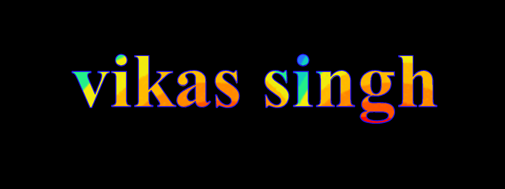

# Model-Web-Front-End

project outputs  project 3

project on flex  box

peiject on flex -->
    display: flex;   
    gap: 20px;  
    flex-wrap: wrap;
    display: flex;
    gap: 20px;
    

     /* transform: translateX(-45%); -->  Moves the box left by 45% of its width */
    /* transform: translateY(20%);    Moves the box down by 20% of its height */
    /* transform: translateZ(90%);    Moves the box closer/farther along Z-axis */

    /* Rotation examples: */
    /* transform: rotateX(60deg);     Rotates box 60° around X-axis (vertical tilt) */
     transform: rotateY(3deg);    /*  Rotates box 40° around Y-axis (horizontal tilt) */
    /* transform: rotateZ(80deg);     Rotates box 80° around Z-axis (flat spin) */

    /* transform: scale(0.5); Shrinks the box to half its size (50%) */

    

 topic --> 
  display: flex;
    gap: 20px;
    flex-wrap: wrap;
    transition: all ease 0.5s;
    overflow: hidden;
     object-fit: cover;
    border-radius: 50px;
    object-position: bottom;
    transition: all ease 0.5s;
    background: linear-gradient(transparent, rgba(1, 0, 0, 0.955));
    position: relative;

 

 
 TEXT  Alnmation

 color: transparent;
    background-size: cover;
    /* background: linear-gradient(red, blueviolet,olivedrab) ; */
    background-image: url(https://media4.giphy.com/media/v1.Y2lkPTZjMDliOTUyeHRiNmJzN3V5amFnOWc0MTVrcDdqZGthNHZjOTd6YWY4Zjc4Ymc3diZlcD12MV9naWZzX3NlYXJjaCZjdD1n/3og0IQ29pE7zRwbh60/giphy-downsized.gif);
    /*  I want to ad the coloer on  the text not a baground  */
    background-clip: text;
    /* now i want to border to Text  */
    -webkit-text-stroke: 4px rgb(33, 19, 230);
    
 

